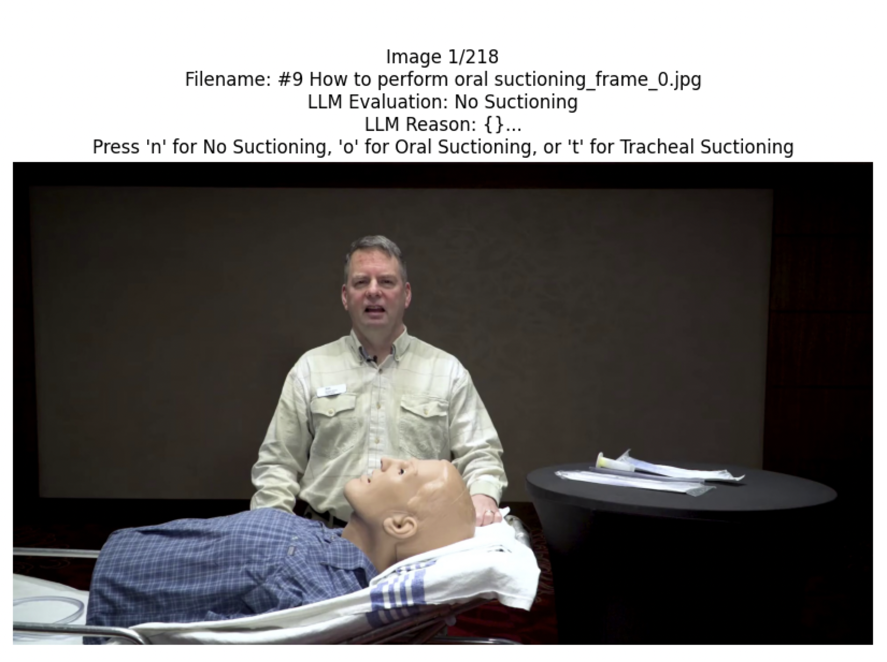
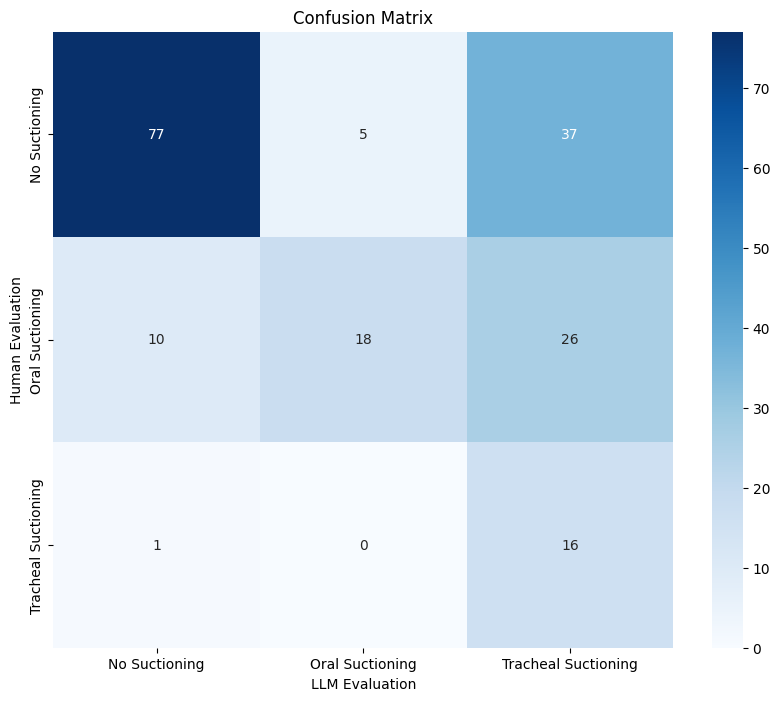
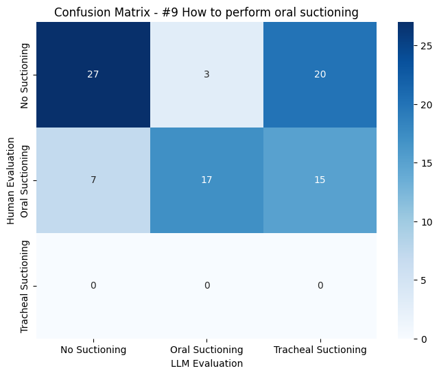

# Medical Suctioning Detection Analysis Report

## Executive Summary
This analysis evaluates the performance of LLaMA 3.2 Vision model in detecting three types of medical suctioning procedures across 190 medical images. The model achieved 58.42% accuracy for the three label classifications (No Suctioning, Oral Suctioning, Tracheal Suctioning), with varying performance across different suctioning types.

Key findings from the analysis:

1. **Overall Performance**
   - Total Images Analyzed: 190 (from four videos)
   - Overall Accuracy: 58.42%
   - Number of Disagreements: 79

2. **Category-Specific Performance**
   - No Suctioning: High precision (0.88) but moderate recall (0.65)
   - Oral Suctioning: Good precision (0.78) but low recall (0.33)
   - Tracheal Suctioning: Low precision (0.20) but high recall (0.94)

3. **Video-Specific Results**
   - Best Performance: "Suctioning (National Tracheostomy Safety Project)" - 80.49% accuracy
   - Moderate Performance: "Performing Oropharyngeal Suctioning" - 65.12% accuracy
   - Lower Performance: "#9 How to perform oral suctioning" - 49.44% accuracy

4. **Key Challenges**
   - Difficulty distinguishing between oral and tracheal suctioning procedures
   - Inconsistent performance across different video sources

5. **Notable Strengths**
   - Strong ability to identify absence of suctioning (0.88 precision)
   - Good performance in clear clinical settings
   - Reliable detection of standard medical equipment

This analysis highlights both the potential and current limitations of using LLaMA 3.2 Vision for medical procedure detection, suggesting specific areas for improvement in future iterations.

## Data Sources
### Video Sources
- [Oral Suctioning](https://www.youtube.com/shorts/l-Rygg3N04Y)
- [Suctioning (National Tracheostomy Safety Project)](https://www.youtube.com/watch?v=lGpfuHdrUgk)
- [Performing Oropharyngeal Suctioning](https://www.youtube.com/watch?v=SwoLb3z25fc)
- [#9 How to perform oral suctioning](https://www.youtube.com/watch?v=DIBMp_yh0gY)
### Frame Extraction Process
The frame extraction process is implemented using OpenCV (cv2) with the following specifications:

- **Sampling Rate**: Every 2 seconds extracted for consistent analysis
- **Implementation**:
  - Uses OpenCV's VideoCapture for efficient video processing
  - Frames are saved as high-quality JPG images
  - Maintains original aspect ratio and resolution
- **Processing Flow**:
  1. Reads video files from source directory
  2. Creates unique output directories for each video
  3. Extracts frames at specified intervals
  4. Applies consistent naming convention: `{video_name}_frame_{frame_number}.jpg`

- **Data Cleaning**:
  - Excluded non-medical content such as drawing.
  - Ensured patients in the dataset are only real medical procedure images

  - 
- **Statistics**:
  - Total frames analyzed: 190
  - Format: High-quality JPG images
  - Original video sources: 4

For detailed implementation, see:
```python:split2frames.py
def extract_frames_from_videos(video_dir, output_dir, frequency=2):
```
## Technical Implementation

### Core Components
1. **LLaMA 3.2 Vision Model Integration**
```python:llama32_detect.py
def img2text(input_path, output_file = None, exportedfile_indexing = False, show_img = False, max_new_tokens = 1000):
    device = torch.device("cuda" if torch.cuda.is_available() else "cpu")
    
    model_id = "meta-llama/Llama-3.2-11B-Vision-Instruct"
    model = MllamaForConditionalGeneration.from_pretrained(
    model_id,
    torch_dtype=torch.bfloat16,
    #device_map="auto",
    )
    
    model = model.to(device)
    processor = AutoProcessor.from_pretrained(model_id)
    
    #tokenizer = AutoTokenizer.from_pretrained('meta-llama/Llama-3.2-11B-Vision-Instruct', trust_remote_code=True)
    #model.eval()
    dir = [input_path]
    if os.path.isdir(input_path):
        dir = os.listdir(input_path)
    
    data = []
    result = {}
    for i, image_path in enumerate(sorted(dir)):
        # Read the image
        if os.path.isdir(input_path):
            image = Image.open(Path(input_path).joinpath(image_path))
        else:
            image = Image.open(image_path)
        
        
        # Describe the image
        input_text = processor.apply_chat_template(msgs("Describe the image in detail."), add_generation_prompt=True)
        inputs = processor(
            image,
            input_text,
            add_special_tokens=False,
            return_tensors="pt"
        ).to(model.device)
        
        res = model.generate(**inputs, max_new_tokens=max_new_tokens)
        res = processor.decode(res[0]).split("<|end_header_id|>")[-1].replace('\n', ' ')
        
        # Show the steps based on the image
        prompt = "The picture is about the following:\n" +res +'\n' + prompt_orig
        
        input_text = processor.apply_chat_template(msgs(prompt), add_generation_prompt=True)
        inputs = processor(
            image,
            input_text,
            add_special_tokens=False,
            return_tensors="pt"
        ).to(model.device)
        
        res = model.generate(**inputs, max_new_tokens=max_new_tokens)
        res = processor.decode(res[0])
        
        
        print('\n', i, image_path)
        #print(generated_text,'\n')
        print('Full Response\n', res)
        reason = res.split("<|end_header_id|>")[-1]
        print("Reason:", reason.replace('\n', ' '))
        
        # Conclude
        input_text = processor.apply_chat_template(
            msgs(reason + "\nTask: Provide your final classification in the following format ONLY:\nCLASSIFICATION: [No Suctioning/Oral Suctioning/Tracheal Suctioning]"),
            add_generation_prompt=True
        )
        inputs = processor(
            image,
            input_text,
            add_special_tokens=False,
            return_tensors="pt"
        ).to(model.device)
        
        res = model.generate(**inputs, max_new_tokens=max_new_tokens)
        res = processor.decode(res[0])
        response_text = res.split("<|end_header_id|>")[-1]
        
        # Extract classification using more robust parsing
        classification = "Unknown"
        if "CLASSIFICATION:" in response_text:
            classification_text = response_text.split("CLASSIFICATION:")[-1].strip()
            # Remove any trailing text after the classification
            classification_text = classification_text.split("\n")[0].strip()
            # Remove any square brackets
            classification_text = classification_text.strip("[]")
            
            # Normalize the text and check for matches
            classification_text = classification_text.lower()
            if "no suctioning" in classification_text:
                classification = "No Suctioning"
            elif "oral suctioning" in classification_text:
                classification = "Oral Suctioning"
            elif "tracheal suctioning" in classification_text:
                classification = "Tracheal Suctioning"
        
        print("Classification:", classification)
        
        # Parse the detailed reason response
        parsed_reason = {}
        if "OBSERVATION:" in reason:
            sections = reason.split("EVIDENCE:")
            if len(sections) > 1:
                parsed_reason = {
                    "observation": sections[0].split("OBSERVATION:")[-1].split("CLASSIFICATION:")[0].strip(),
                    "evidence": sections[1].strip()
                }
        
        data.append([image_path, classification, parsed_reason])
        result[image_path] = (classification, parsed_reason)
        if show_img:
            display(HTML(f''))
    data.sort()
    
    # if output_file is specified, it generates tsv file
    if output_file is not None:
        data_frame = pd.DataFrame(data, columns=['Image', 'llm_evaluation', 'Reason'])
        data_frame.to_csv(output_file, sep = '\t', index = exportedfile_indexing, encoding = 'utf-8')
    return result
```

## Evaluation Process
### Human Evaluation Interface



The human evaluation interface provides a simple way to assess images with the following features:
- Displays current image with filename
- Shows LLM's evaluation and reasoning
- Keyboard controls:
  - 'n' for No Suctioning
  - 'o' for Oral Suctioning
  - 't' for Tracheal Suctioning
- Progress tracking and automatic result saving

Implementation details:
```python:human_evaluation.py
class ImageEvaluator:
    def __init__(self):
        # Get list of images from frames directory
        self.image_files = sorted([f for f in os.listdir("frames") if f.endswith(('.png', '.jpg', '.jpeg'))])
        self.current_index = 0
        self.results = {}
        
        # Load LLM evaluations
        self.llm_df = pd.read_csv('llm_result.tsv', sep='\t')
        self.llm_df.set_index('Image', inplace=True)
        
        # Create figure
        self.fig = plt.figure(figsize=(10, 10))
        self.ax_img = plt.axes([0.1, 0.2, 0.8, 0.7])
        
        # Connect keyboard event handler
        self.fig.canvas.mpl_connect('key_press_event', self.on_key_press)
        
        # Start evaluation
        self.evaluate_images()
        
    def evaluate_images(self):
        plt.ion()  # Turn on interactive mode
        
        while self.current_index < len(self.image_files):
            self.display_current_image()
            plt.pause(0.001)  # Small pause to allow GUI to update
            
            # Wait for keyboard input
            while self.current_index == len(self.results):
                plt.pause(0.1)
                
                # Check if we've processed all images
                if self.current_index >= len(self.image_files):
                    plt.close('all')
                    self.save_results()
                    return  # Exit the method after saving
        
        # Save results if we exit the main loop
        plt.close('all')
        self.save_results()

    def display_current_image(self):
        current_image = self.image_files[self.current_index]
        
        # Get LLM evaluation and reason if available
        llm_eval = "Unknown"
        reason = "No reason provided"
        if current_image in self.llm_df.index:
            llm_eval = self.llm_df.loc[current_image, 'llm_evaluation']
            reason = self.llm_df.loc[current_image, 'Reason']
        
        # Clear previous image
        self.ax_img.clear()
        
        # Load and display current image
        image_path = os.path.join("frames", current_image)
        img = Image.open(image_path)
        self.ax_img.imshow(img)
        self.ax_img.axis('off')
        self.ax_img.set_title(f"Image {self.current_index + 1}/{len(self.image_files)}\n"
                       f"Filename: {current_image}\n"
                       f"LLM Evaluation: {llm_eval}\n"
                       f"LLM Reason: {reason[:300]}...\n"
                       f"Press 'n' for No Suctioning, 'o' for Oral Suctioning, or 't' for Tracheal Suctioning")  # Show first 300 chars of reason
        
        plt.draw()
        
    def on_key_press(self, event):
        if event.key in ['n', 'o', 't'] and self.current_index < len(self.image_files):
            current_image = self.image_files[self.current_index]
            if event.key == 'n':
                self.results[current_image] = 'No Suctioning'
            elif event.key == 'o':
                self.results[current_image] = 'Oral Suctioning'
            elif event.key == 't':
                self.results[current_image] = 'Tracheal Suctioning'
            self.current_index += 1
            if self.current_index < len(self.image_files):
                self.display_current_image()
            plt.draw()
        
    def save_results(self):
        # Convert results to DataFrame and save as TSV
        df = pd.DataFrame.from_dict(self.results, orient='index', columns=['human_evaluation'])
        df.index.name = 'Image'
        df = df.sort_index()  # Sort by filename
        df.to_csv('human_result.tsv', sep='\t')
        print(f"\nResults saved to human_result.tsv")
        print(f"Evaluated {len(self.results)} images")
```

## Results Analysis
### Performance Metrics
- Total Images: 190
- Overall Accuracy: 58.42%
- Number of Disagreements: 79

### Classification Report
| Class | Precision | Recall | F1-Score | Support |
|-------|-----------|---------|-----------|----------|
| No Suctioning | 0.875 | 0.647 | 0.744 | 119 |
| Oral Suctioning | 0.783 | 0.333 | 0.468 | 54 |
| Tracheal Suctioning | 0.203 | 0.941 | 0.333 | 17 |

### Confusion Matrix


## Image Analysis Examples

### Correct No Suctioning Detection

**Image**: `Performing Oropharyngeal Suctioning_frame_36.jpg`
- **Evaluation**: Both human and LLM correctly identified no suctioning
- **LLM Reasoning**: {}...
- **Key Features**: Absence of suctioning equipment or procedure


**Image**: `#9 How to perform oral suctioning_frame_69.jpg`
- **Evaluation**: Both human and LLM correctly identified no suctioning
- **LLM Reasoning**: {'observation': "**\n\nThe image depicts a man demonstrating an intubation procedure on a mannequin. The man, with short gray hair, is dressed in a pale yellow button-down shirt and is seated behind t...
- **Key Features**: Absence of suctioning equipment or procedure

### Correct Oral Suctioning Detection

**Image**: `#9 How to perform oral suctioning_frame_49.jpg`
- **Evaluation**: Both human and LLM correctly identified oral suctioning
- **LLM Reasoning**: {}...
- **Key Features**: Dental setting, oral cavity access, wide-bore suction tools


**Image**: `#9 How to perform oral suctioning_frame_79.jpg`
- **Evaluation**: Both human and LLM correctly identified oral suctioning
- **LLM Reasoning**: {}...
- **Key Features**: Dental setting, oral cavity access, wide-bore suction tools

### Correct Tracheal Suctioning Detection

**Image**: `Suctioning (National Tracheostomy Safety Project)_frame_18.jpg`
- **Evaluation**: Both human and LLM correctly identified tracheal suctioning
- **LLM Reasoning**: {'observation': "** The image shows a person's neck with a tracheostomy tube inserted, and a blue glove on the left side. The purpose of the image is to illustrate the proper placement of a tracheosto...
- **Key Features**: Tracheostomy access, sterile catheter, supine positioning


**Image**: `Suctioning (National Tracheostomy Safety Project)_frame_5.jpg`
- **Evaluation**: Both human and LLM correctly identified tracheal suctioning
- **LLM Reasoning**: {}...
- **Key Features**: Tracheostomy access, sterile catheter, supine positioning

### Notable Disagreements

**Image**: `#9 How to perform oral suctioning_frame_17.jpg`
- **Human Evaluation**: No Suctioning
- **LLM Evaluation**: Tracheal Suctioning
- **LLM Reasoning**: {}...
- **Analysis of Disagreement**: Misclassification between No Suctioning and Tracheal Suctioning


**Image**: `#9 How to perform oral suctioning_frame_75.jpg`
- **Human Evaluation**: Oral Suctioning
- **LLM Evaluation**: No Suctioning
- **LLM Reasoning**: {'observation': "**\n\nThe image shows a close-up view of a baby doll with a tube inserted into its mouth. The doll's face is the main focus of the image, with its mouth open and a clear plastic tube ...
- **Analysis of Disagreement**: Misclassification between Oral Suctioning and No Suctioning


**Image**: `Suctioning (National Tracheostomy Safety Project)_frame_13.jpg`
- **Human Evaluation**: Tracheal Suctioning
- **LLM Evaluation**: No Suctioning
- **LLM Reasoning**: {'observation': "** The image shows a medical device, likely an oxygen mask or ventilator, with a clear plastic tube and a green cord. The device is placed on a person's face, with the tube inserted i...
- **Analysis of Disagreement**: Misclassification between Tracheal Suctioning and No Suctioning


## Per-Video Analysis

### Suctioning (National Tracheostomy Safety Project)
_frame_10.jpg)

*Representative frame showing tracheal suctioning*

- **Total Frames**: 41
- **Accuracy**: 80.49%

#### Classification Report
| Class | Precision | Recall | F1-Score | Support |
|-------|-----------|---------|-----------|----------|
| No Suctioning | 0.944 | 0.708 | 0.810 | 24 |
| Oral Suctioning | No samples | No samples | No samples | 0 |
| Tracheal Suctioning | 0.762 | 0.941 | 0.842 | 17 |

#### Confusion Matrix
.png)

### Performing Oropharyngeal Suctioning


*Representative frame showing oral suctioning*

- **Total Frames**: 43
- **Accuracy**: 65.12%

#### Classification Report
| Class | Precision | Recall | F1-Score | Support |
|-------|-----------|---------|-----------|----------|
| No Suctioning | 0.933 | 0.848 | 0.889 | 33 |
| Oral Suctioning | 0.000 | 0.000 | 0.000 | 10 |
| Tracheal Suctioning | No samples | No samples | No samples | 0 |

#### Confusion Matrix


### #9 How to perform oral suctioning


*Representative frame showing oral suctioning*

- **Total Frames**: 89
- **Accuracy**: 49.44%

#### Classification Report
| Class | Precision | Recall | F1-Score | Support |
|-------|-----------|---------|-----------|----------|
| No Suctioning | 0.794 | 0.540 | 0.643 | 50 |
| Oral Suctioning | 0.850 | 0.436 | 0.576 | 39 |
| Tracheal Suctioning | No samples | No samples | No samples | 0 |

#### Confusion Matrix



## Future Work
1. **Model Improvements**
   - Enhance distinction between oral and tracheal suctioning
   - Improve detection of suctioning equipment and setup
   - Add confidence scoring for predictions

2. **Data Collection**
   - Balance dataset across all three suctioning types
   - Include more examples of tracheal suctioning
   - Add temporal context between frames


## Project Files
### Core Components
- **llama32_detect.py**: Vision model implementation
- **human_evaluation.py**: Manual annotation interface
- **calculate_accuracy.py**: Performance analysis
- **report.py**: Analysis report generation

### Output Files
- **llm_result.tsv**: Model predictions and reasoning
- **human_result.tsv**: Human annotations
- **disagreements.tsv**: Cases where model and human differ
- **accuracy_results.txt**: Detailed performance metrics
## LLM Detection Pipeline

### Model Configuration
```python
model_id = 'meta-llama/Llama-3.2-11B-Vision-Instruct'
model = MllamaForConditionalGeneration.from_pretrained(
    model_id,
    torch_dtype=torch.bfloat16
)
```

### Prompt Engineering
The model uses a carefully crafted prompt with three key components:

1. **Role Definition**
```
You are a medical image analysis expert. Your task is to carefully analyze the image and determine if it shows a patient undergoing suctioning using a tube. Classify the scenario into one of the following categories: No Suctioning, Oral Suctioning (dental), or Tracheal Suctioning (throat/covid).
```

2. **Definitions and Criteria**
```
1. Oral Suctioning:
   - Performed exclusively by licensed dentists or dental assistants
   - Suction device must be actively placed inside patient's oral cavity
   - Specifically for removal of oral fluids during dental procedures
   - Patient must be seated upright in a dental chair
   - Equipment: Wide-bore dental suction tools (>8mm diameter)
   - Caregiver position: Within 45 degrees of patient's front, at oral level

2. Tracheal Suctioning:
   - Performed only by licensed healthcare professionals
   - Sterile catheter must be actively inserted through tracheostomy opening
   - Exclusively for clearing respiratory secretions from airways
   - Patient must be supine or at maximum 30 degree incline
   - Equipment: Sterile flexible catheter (10-14 French/3.3-4.7mm diameter)
   - Caregiver position: Standing at head of bed, within 30cm of patient's head
```

3. **Analysis Framework**
The model evaluates each image using four key aspects:

- **Patient and Caregiver Assessment**
  - Patient presence and positioning
  - Healthcare provider identification
  - Provider positioning relative to patient

- **Equipment Verification**
  - Suction device type and size
  - Active insertion verification
  - Proper equipment usage

- **Procedure Context**
  - Clinical setting assessment
  - Patient positioning
  - Supporting medical equipment

- **Active Suctioning Indicators**
  - Ongoing procedure verification
  - Proper technique assessment
  - Supporting device presence

### Processing Pipeline


### Output Format
The model generates a structured output with three components:
1. Detailed analysis of the medical scene
2. Classification into one of three categories:
   - No Suctioning
   - Oral Suctioning
   - Tracheal Suctioning
3. Supporting reasoning with key observations

Example output:
```
**Analysis of the Image**
The image shows a medical professional in PPE standing at the head of a hospital bed...

**Key Observations**
- Patient positioning: Supine at 30° incline
- Equipment: Sterile catheter (4mm diameter)
- Procedure: Active insertion through tracheostomy
- Setting: ICU with monitoring equipment

**Classification**
Tracheal Suctioning
```

